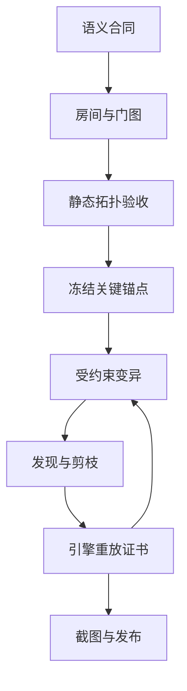

# 自动化魔塔设计：先空间、后数值、可回放地收敛

状态：**10F demo 的长期设计与调优协议**。本文件把本项目已经采用的
拓扑冻结、关键内容保护、求解器证书与受约束变异器归纳为一条可重复执行的
流程。它不是“让某个标准脚本通关”的说明；目标是做出有压力、存在多种真实
解法、且能被引擎重放证明的魔塔。

## 总原则

先决定玩家在什么空间里做什么选择，再决定每一次战斗扣多少血。

1. **拓扑先于数值。** 房间、走廊、门、卡片、楼梯、Boss 群、核心和关键遗物
   未冻结前，不运行数值变异器，不以标准路线的成败改怪物数值。
2. **关键内容不可被调优器碰触。** 核心拥有者、关键遗物、Boss 群、必经门禁、
   楼梯、卡片类型和房间归属，属于拓扑合同；普通遭遇槽、普通奖励与数值才是
   后续候选面。
3. **启发式失败不是游戏无解。** 固定商店循环、贪心策略和局部搜索只负责发现
   候选；“至少有一条解”与最终难度只能由 `engine.js` 权威重放的证书判定。
4. **剪枝必须可证明。** 只合并会生成相同权威后继状态的节点。不能因为一条
   路“看起来绕”或“不符合当前策略”就删掉。

## 自动化设计的八步



| 步骤 | 产物 | 允许改动 | 必须拒绝的情况 |
| --- | --- | --- | --- |
| 1. 语义合同 | 每层角色、Boss 集中节奏、核心簇、关键遗物归属 | 叙事目标、关卡职责 | “每层一个 Boss”式流程化；没有终局准备段 |
| 2. 房间与门图 | 入口、枢纽、侧室、门槛、Boss 前庭、楼梯的图 | 房间连接和门的位置 | 仅由随机墙块构成的蛇形迷宫；所有层同一模板 |
| 3. 静态拓扑验收 | 可达性、割点、卡片状态图、房间度量 | 修正地图和卡片来源/去向 | 结界可绕过、门后没有权限/价值、Boss 可绕过 |
| 4. 冻结关键锚点 | 拓扑锁与回归测试 | 只改普通遭遇槽的编号占位 | 移动核心、关键宝物、Boss 群、楼梯或必经门 |
| 5. 标定基线 | 可重放的困难路线与路线族 | 记录而非数值调节 | 用单条“标准路线”定义可玩性 |
| 6. 受约束变异 | 普通敌人、普通奖励、非关键位置的候选目录 | 仅已声明的数值字段/普通槽 | 变异关键单位，或把暂存候选写进生产地图 |
| 7. 求解与选择 | Pareto 前沿、路线证书、难度/多样性报告 | 调整候选参数 | 无证书即接受；只看胜率不看路线差异 |
| 8. 发布验证 | 引擎重放、构建、截图、生产探针 | 发布已证实的单一候选 | 测试规则与生产规则不一致；视觉未检查 |

当前 10F 的语义合同与关键锚点见
[10F progression topology lock](10f-progression-topology-lock.md)；房间/卡片细则见
[10F room-card topology](10f-room-card-topology.md)。数值阶段只能在这两份合同稳定后开始。
第二章的续篇合同、MP 机制与新单位身份见
[Act II topology lock](20f-act-ii-topology-lock.md)；它同样在完整房间图冻结前禁止数值调优。

## 关卡低级错误清单

| 错误 | 为什么会坏 | 自动检查 / 修法 |
| --- | --- | --- |
| **结界不是割点** | 玩家从侧路绕过，门只是装饰 | 门关闭时删除该格，验证目标与入口不连通；检查门两侧属于不同开放区域 |
| **结界拦住了空死路** | 玩家消耗卡后没有新权限或奖励 | 每张门必须保护楼梯、关键物、谜题许可、商店、Boss 前庭或有价值的侧室 |
| **卡片被简单削到稀少** | 选择少、软锁多，无法形成路线差异 | 保留足量卡片，增加有价值的门和替代门序；验证所有可行卡片账本从不为负 |
| **卡片过剩且所有门可白嫖** | 门不再是资源决策 | 比较每条路线的卡余额；让额外卡通向不同奖励/风险，而非同一条无代价捷径 |
| **商店过密** | 每层都变成回访、买空、再计算的例行流程，压缩真实空间决策 | 每十层只留一座显式转换节点；商店必须位于一次重大守卫群之前，并用卡片/前庭让到达本身有代价 |
| **房间同质化** | 每层都成为“入口—中枢—右门—Boss”模板 | 为每层声明空间语法：双圣所、锻炉回路、三守卫战场、镜界环廊、三相封印殿等；截图做人工复核 |
| **只有走廊，没有房间** | 路线只剩线性执行，没有停留、取舍或可读性 | 每层至少有入口区、决策枢纽、阈值、可选侧室、目标区中的若干可识别组合 |
| **每层都强制 Boss** | 节奏被平均化，Boss 没有压迫感 | 用无 Boss 的教学/准备层衬托 F2/F5/F7/F8/F10 的 Boss 簇；终局保持无恢复的连续压迫 |
| **Boss 没有前庭或可绕开** | 既不易读也不构成关卡承诺 | Boss 房前保留清晰前庭；对必经 Boss 验证它仍是楼梯/终局的真实门槛 |
| **关键宝物不值得代价** | 可选分支变成假选择 | 用重放比较“拿/不拿”在后续战斗、经济和卡片权限中的实际差异 |
| **拓扑完成前调数值** | 后续移动门或敌人又要把数字全部重调 | 在拓扑锁、截图和卡片状态图通过前，数值变异器必须拒绝执行 |
| **把启发式全灭当作无解** | 错删高难但有趣的解 | 用启发式做发现，保留独立的存在性搜索和权威重放证书 |
| **为了加速搜索删掉真实状态** | 可能删掉唯一解 | 只做等价后继合并；任何归并都要有重放/等价单测 |

## 求解器：状态、Pareto 与安全归并

把一个搜索标签拆成三部分：

\[
S = (W, R, L)
\]

- `W`：世界状态——动态事件向量、谜题状态、遗物、商店次数、访问楼层、胜利；
- `R`：资源向量——HP、攻击、防御、金币、三种卡，以及解锁后 MP / 最大 MP；
- `L`：当前位置——楼层与开放连通分量。

常规求解器以 `W + L` 作为结构键，在相同结构键内只保留资源上不被支配的
Pareto 标签：若 A 的每一种资源都不低于 B，且至少一项更高，则 B 永远无需继续
扩展。实现位于 [search.js](../src/solver/search.js) 与
[frontier.js](../src/solver/frontier.js)。

罗盘是一个特别大的分支源：已访问的每层都可传送，许多来源位置会产生同一个
到达状态。这里的安全归并不是删除“上行传送”或展开远端宏，而是记忆一个
**真实状态转移**：

\[
M(S, t) = (W, R, t) \quad \text{其中刻意删除来源 } L
\]

只有当以下条件同时满足，后到的传送才可略过：

1. 目标楼层 `t` 相同；
2. `W` 的所有轴相同；
3. `R` 的所有轴相同；
4. 引擎的 `teleportToFloor()` 不读取来源 `L`，并确定性地落在 `t` 的固定锚点；
5. 后续自动归一化也是确定性的。

于是两个来源的“传送 + 归一化”后继完全一致。代码在
[tower-teleport-transition-memo-adapter.js](../src/solver/tower-teleport-transition-memo-adapter.js)，
单测既检查资源/事件绝不被抹去，也把一对真实 Tower 状态交给权威传送并比较后继。
旧的 fixed-purchase API 保留为兼容包装，不改变旧研究的语义。

运行 `npm run profile:demo10:compass-merge` 会在**相同搜索预算**下比较普通适配器和
归并适配器。当前冻结的 10F，在 `10,000` 个展开标签预算下：

| 指标 | 基线 | 精确归并 | 改善 |
| --- | ---: | ---: | ---: |
| 生成动作 | 56,478 | 32,256 | 42.9% 更少 |
| 传送动作 | 32,678 | 8,456 | 74.1% 更少 |
| 结构状态 | 9,436 | 9,436 | 相同 |
| Pareto 峰值 | 6 | 6 | 相同 |

这证明它压缩的是重复**边**，不是用数值或策略偷偷抹掉一个结构分支；它也不等于
“通用存在性搜索已经完全求解”。后者仍需要分解为可证明的子问题和更好的上界。

## 变异器—求解器迭代：难而不爆炸

数值阶段的候选评估应采用两层搜索，而不是让一个巨大全状态搜索同时决定地图、
商店、战斗顺序和数值。

```text
freeze(topology, critical anchors)
baseline = certify(authoritative replay)
for candidate in declared ordinary-slot mutations:
    withCandidate(candidate):                  # 临时安装，随后自动还原
        assertTopologyLocks()
        scout = run policy / route-family seeds # 只负责快速发现
        if scout has no difficult plausible route: reject
        certificates = replay each surviving route in engine.js
        if no authoritative winning certificate: reject
        score = (forgiving routes fewer,
                 minimum margin safe,
                 independent route families enough,
                 edit distance small)
select Pareto-feasible candidate
commit one candidate + regression proof
```

关键做法：

1. **先做精确剪枝，再施加数值压力。** Pareto 支配、权威证书支持的上界、以及上文的
   传送后继归并，先减少无信息的搜索膨胀；不能以错误的“策略限制”替代证明。
2. **把变异作为候选收缩器。** 当路线空间过宽时，只提高已声明的普通敌方遭遇或调换
   普通位置，使大量宽松路线在早期侦察阶段被筛掉；绝不移动/改写拓扑锚点。
3. **两段预算。** 小预算侦察用于快速淘汰显然太松、太脆或没有路线多样性的候选；
   只有幸存候选才进入高预算的 Pareto 搜索和 `engine.js` 重放。这样不会让每个变异
   都触发一次指数级全局求解。
4. **MP 档位只在战斗边枚举。** UI 选择的档位不是长期状态轴。对一名敌人只保留
   `x=0` 与每个首次降低攻击回合数的最小可负担档位；相同回合数的高 MP 支出严格被
   支配。证书必须记录档位，回复 MP 的物品则不得自动拾取。
5. **多目标选择，不追求“路线越少越好”。** 优先保留足够少的碾压路线、足够安全的
   最低余量、至少三类实际决策不同的路线族，以及最小的数值改动。单条完美脚本并不
   是好设计。
6. **证书和恢复必须成对出现。** 临时候选安装前后断言锁不变；接受候选后，把成功
   路线存成引擎重放证书。这样调优既可复现，也不会污染下一轮实验。

现有的受约束压力样例在
[demo-10-floor-pressure-profile.js](../src/tuner/demo-10-floor-pressure-profile.js)：它只开放
普通敌人的显式字段、每次候选前后检查拓扑锁，并把发现到的路线交给权威回放。
路线多样性门槛与当前结果见 [10F 路线族证书](10f-route-family-certification.md)。

## 每次提交前的最小门槛

```bash
npm test
npm run validate:demo10
npm run certify:demo10:routes
npm run verify:demo10:pressure
npm run profile:demo10:compass-merge
node scripts/build.mjs
```

地图/拓扑提交还必须运行相应的静态门禁与截图工作流；数值提交不可以借机修改拓扑
合同。生产构建使用的规则必须和求解器、验证器及浏览器画面使用同一份源码规则。
